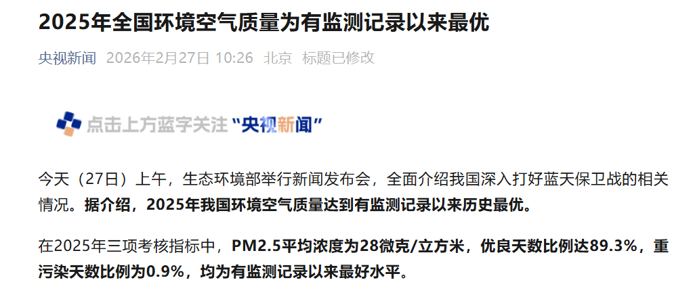

展望十五五，环保依旧是重要的国家政策和治理目标。根据央视新闻：

可喜可贺！蓝天保卫战取得重大成果。

生态环境部大气环境司司长李天威表示，从区域看，重点区域示范带头。空间格局总体呈**“南方空气质量好、北方改善幅度大”**特点，**2025年PM2.5浓度最低的10个省份中南方占7个**，“十四五”以来PM2.5浓度降幅最大的10个省份全在北方。特别是，**京津冀及周边地区和汾渭平原**共49个城市，PM2.5浓度降幅最大的20个城市几乎全在这两个区域，其中，山西临汾2025年PM2.5浓度为35.1微克/立方米，较2020年下降46.5%，降幅全国第一。

##  地理因素塑造天然的差生

### 汾渭平原：典型的“盆地/河谷”闭塞效应

汾渭平原主要由黄河流域的汾河平原（山西）和渭河平原（即关中平原，陕西）组成。

- **四面环山的地形：** 汾渭平原的四周被高大山脉环绕。南有秦岭，北有黄土高原，东有太行山脉，西有吕梁山脉。这使得整个平原呈现出一个狭长的、半封闭甚至全封闭的“盆地”或“深谷”形态。
- **水平扩散受阻（风速小）：** 由于四周高山的阻挡，外部的冷空气或强风很难直接长驱直入。该区域的年平均风速显著低于东部平原，导致本地工业、燃煤和机动车排放的污染物无法被风吹散，只能在盆地内部不断累积。
- **垂直扩散受阻（强逆温层）：** 在冬季，冷空气一旦沉降到盆地底部，就很难被排出。地面温度低，上层空气相对较暖，极易形成深厚且持久的**“逆温层”**。逆温层就像给整个平原盖上了一个“大锅盖”，导致污染物在垂直方向上也无法对流扩散，最终形成持续的重污染天气。

### 河北南部：典型的“山前”阻挡效应

河北南部（如石家庄、邢台、邯郸等地）位于华北平原的西部边缘。

- **半封闭的“簸箕”地形：** 河北南部的西侧是高耸的太行山脉，但其东侧和南侧则是广阔的华北平原，地势总体呈西高东低、向东南敞开的形态。
- **污染物“堆积”效应：** 当华北地区盛行偏南风或偏东风时，来自中东部平原的工业污染物和水汽会被风推着向西、向北移动。当这些气团遇到太行山脉的阻挡时，气流速度骤降，污染物被迫在山脚下（即河北南部山前地带）大量堆积。
- **“焚风”与下沉气流：** 有时越过太行山的偏西气流在下沉过程中会形成“焚风效应”，导致近地面气温升高，大气层结变得稳定，进一步抑制了污染物的垂直对流。

## 环保和GDP双赢吗？

“十四五”期间，**全国PM2.5平均浓度下降了20%，但我国国内生产总值增长了30%，保护与发展实现了“双赢”**。全国共有29个城市国内生产总值超过万亿，但它们的PM2.5平均浓度为27.8微克/立方米，全都优于全国平均水平。

统计学的魅力！

## 展望

