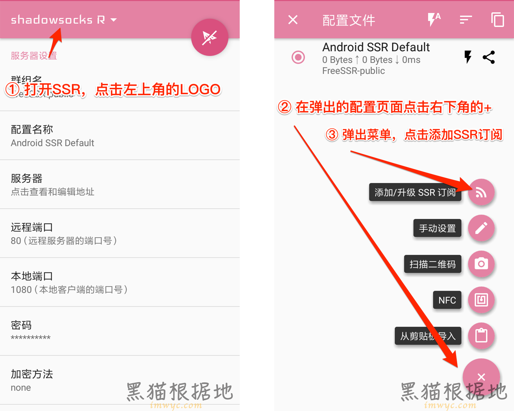
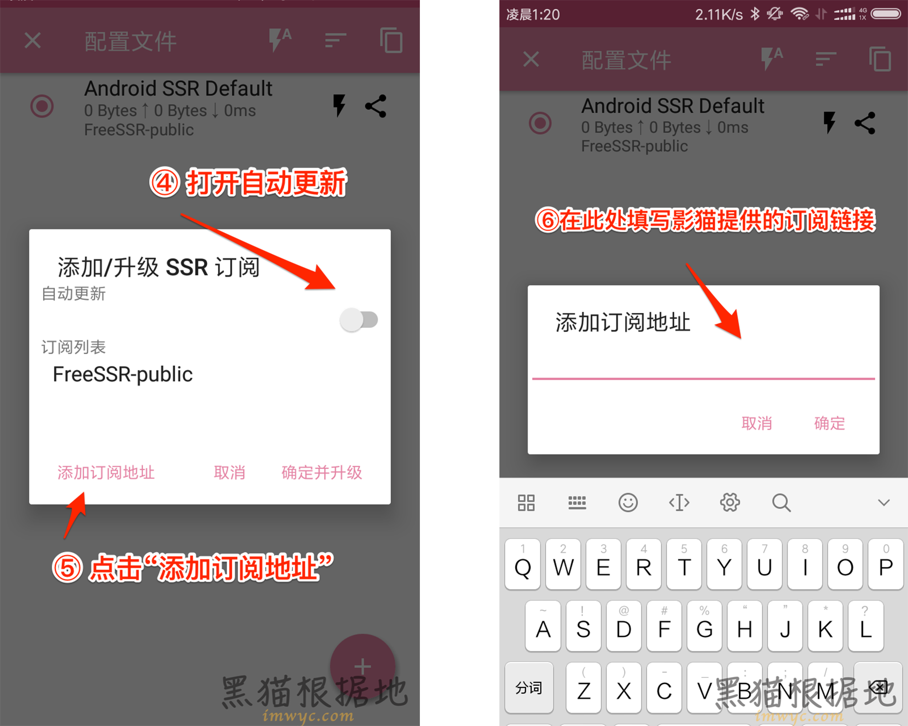
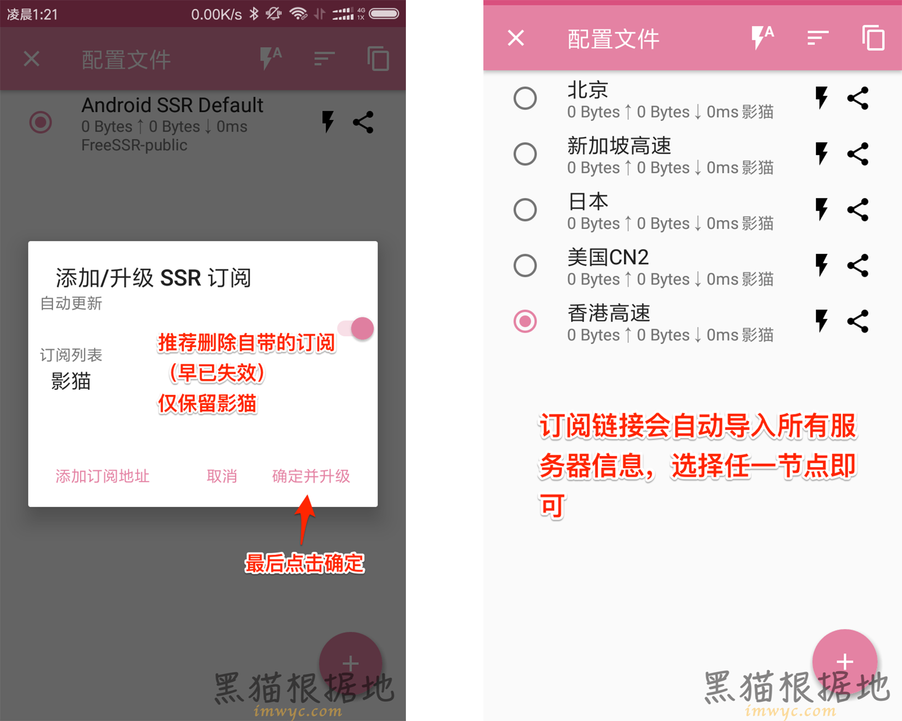
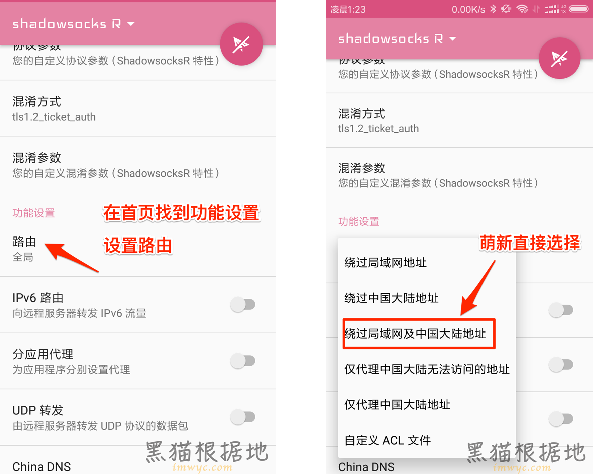
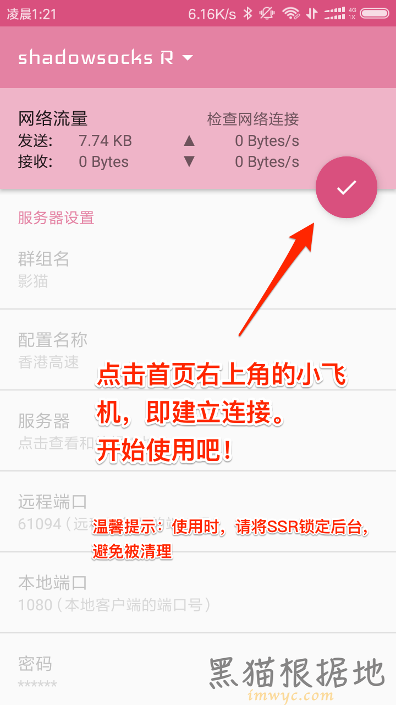

# Android - SSR

### 客户端安装

[ 点击下载](https://yun-1256050155.cos.ap-beijing.myqcloud.com/ssr/ssr-android.apk)，安装，运行

### 获取订阅链接

打开影猫官网，在[用户中心](https://sscat.me/user)可以查看自己的订阅链接，点击拷贝。

### 将订阅链接导入客户端

请按照图中的标注进行操作


**路由模式的选择：**

* 全局：全部流量均走代理
* 绕过局域网/中国大陆地址：自动分流，局域网和大陆IP不走代理，其他流量走代理
* 仅代理中国大陆无法访问的地址：自动分流，只有被墙的地址走代理，需要定期更新列表


### 开始连接

在APP首页，点击右上角的小飞机图标即可建立连接。连接成功后，会出现对勾图标。

