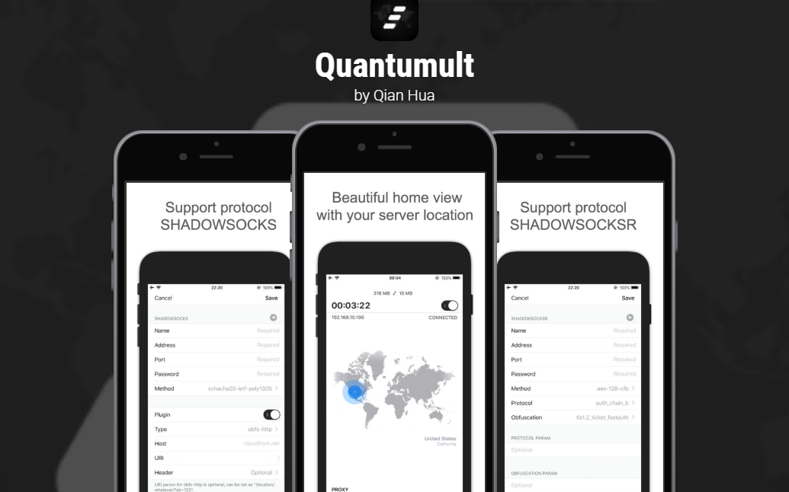
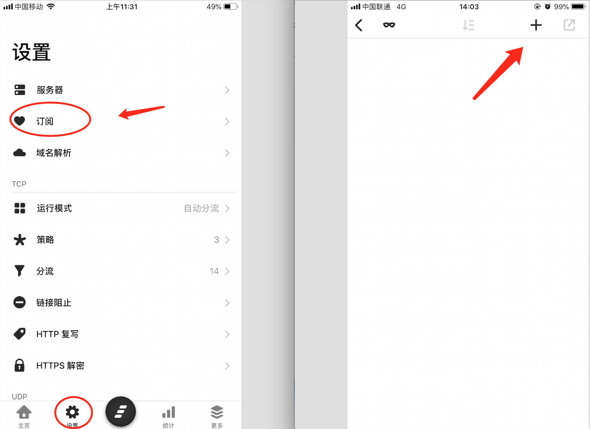
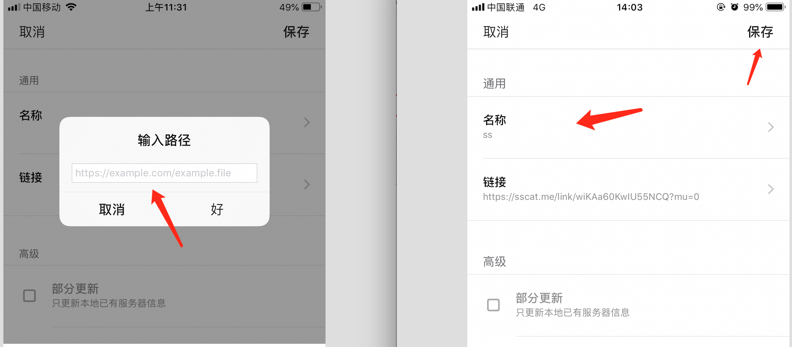
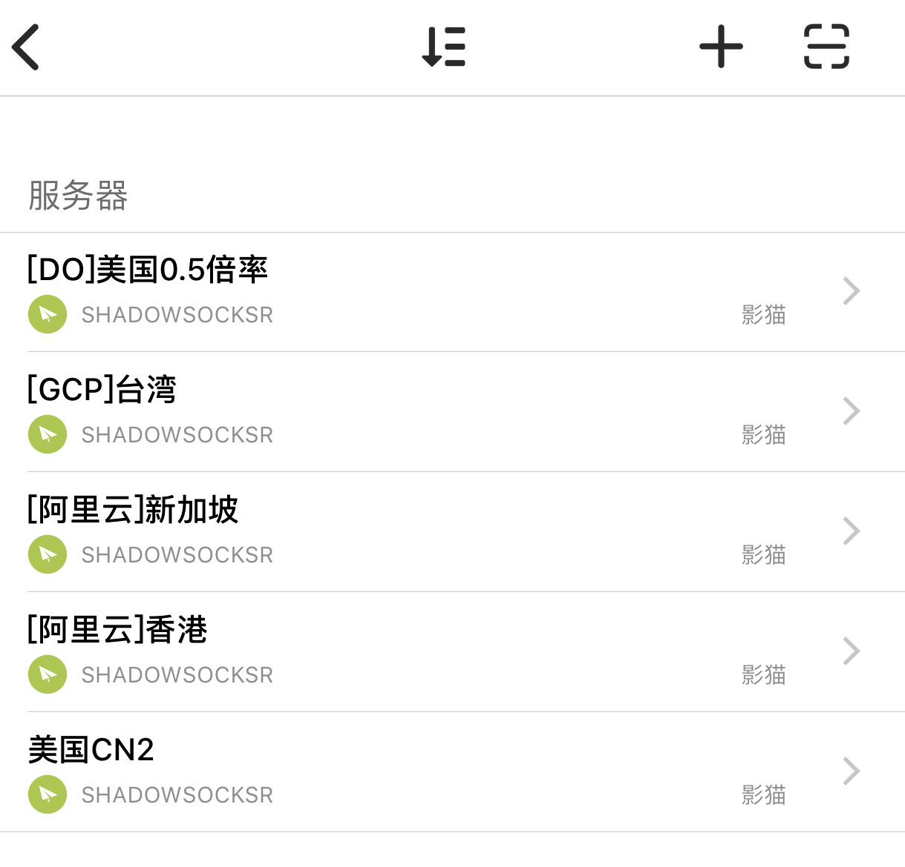
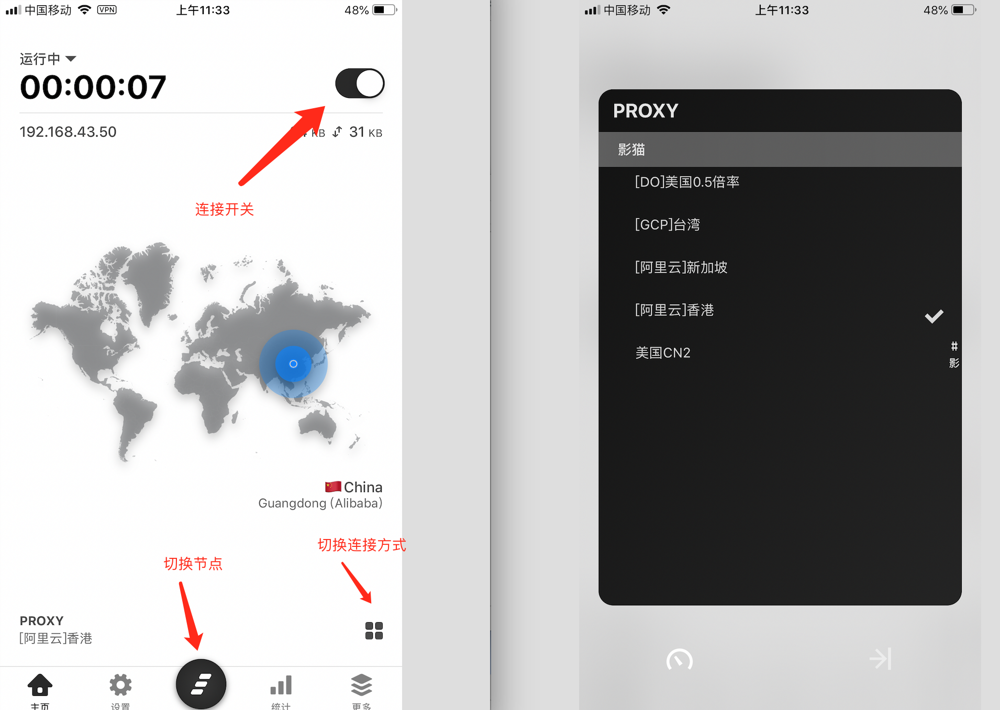

# iOS - Quantumult

Quantumult是一款优秀的代理工具，界面更加炫酷！

如果有自己的美区账号，则可以直接搜索Quantumult，购买并下载。


影猫为用户提供美区账号，并且已购买Quantumult，用户可以免费下载安装。



请在用户中心开工单索取美区账号


### 获取订阅链接

打开影猫官网，在[用户中心](https://sscat.me/user)可以查看自己的订阅链接，点击拷贝。​

### 将订阅链接导入客户端 {#jiang-ding-yue-lian-jie-dao-ru-ke-hu-duan}

打开Quantumult，在设置选项卡，点击`订阅`，再点击右上角＋号，添加订阅。

将影猫订阅链接粘贴至输入框，并随意填写`名称`（方便自己区分），最后点击保存。

保存后，客户端会导入服务器节点信息，可以在设置-服务器中查看。

### 开始连接

如上图所示，开始连接


连接方式的说明

* 全局代理： 全部流量走代理
* 自动分流：根据设定的规则自动分流，默认配置是国内直连、国外代理
* 全局直连：全部流量不走代理


