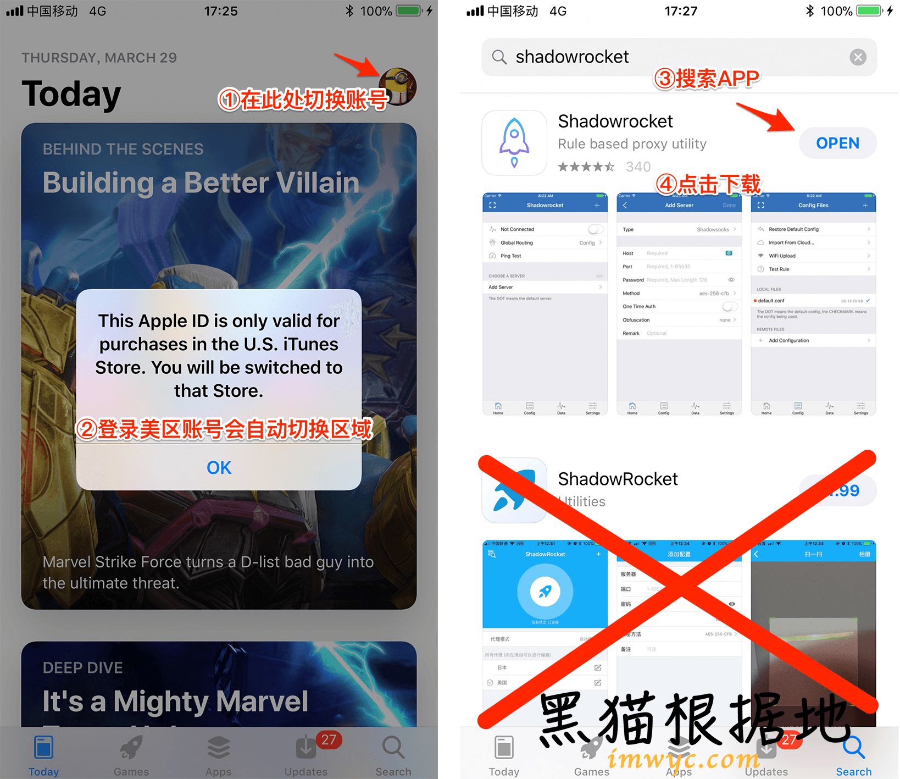
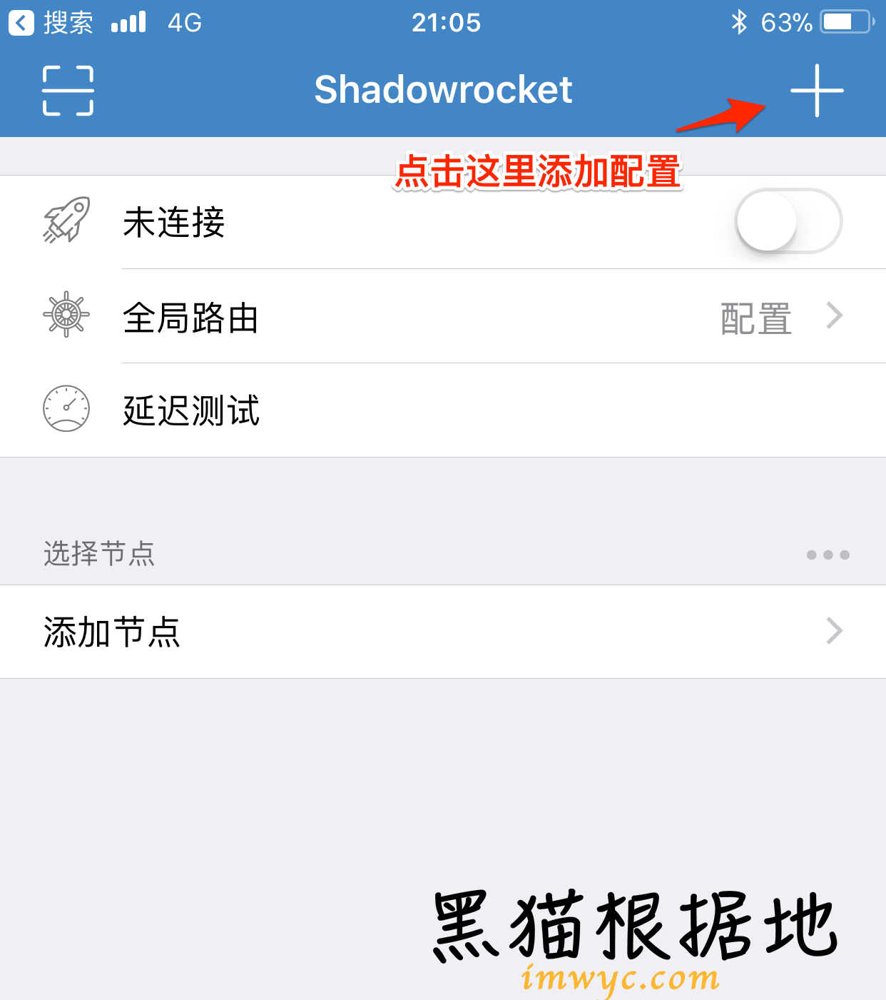
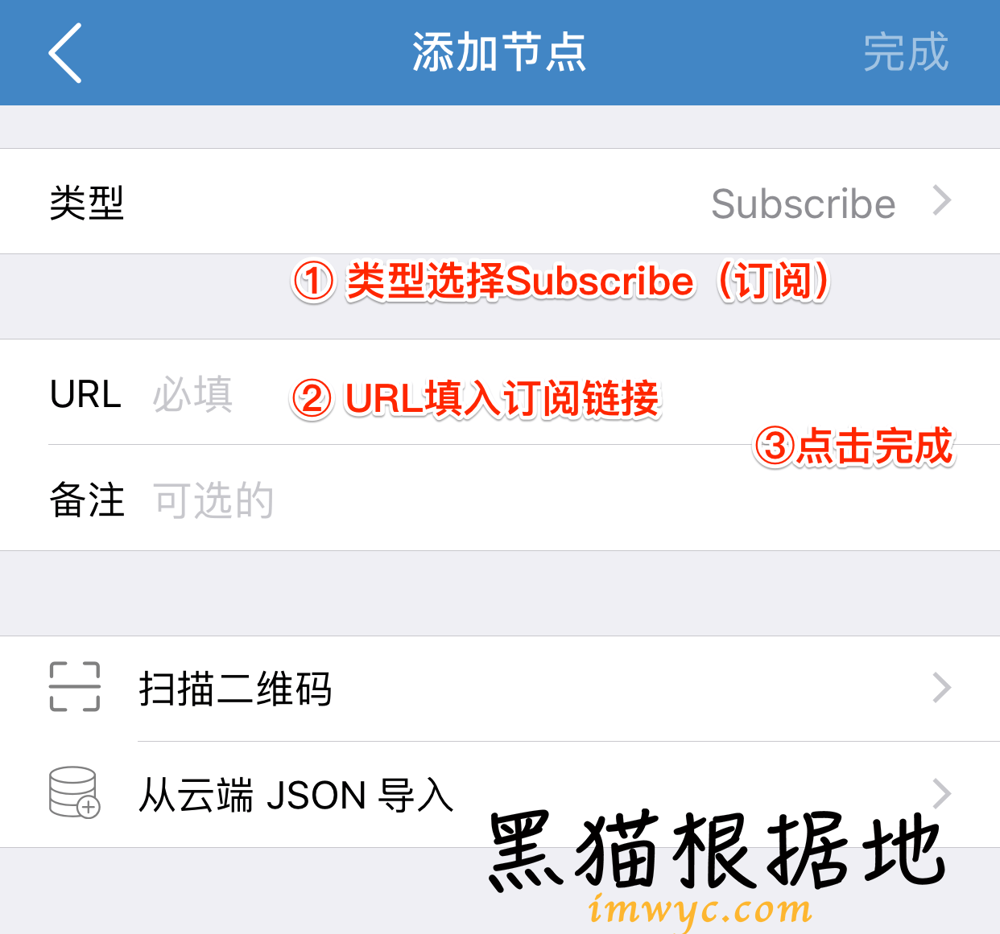
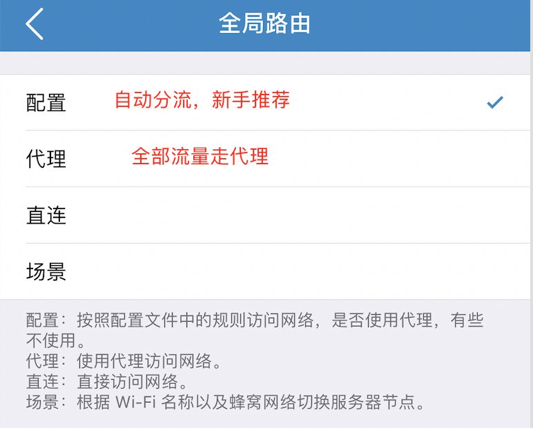
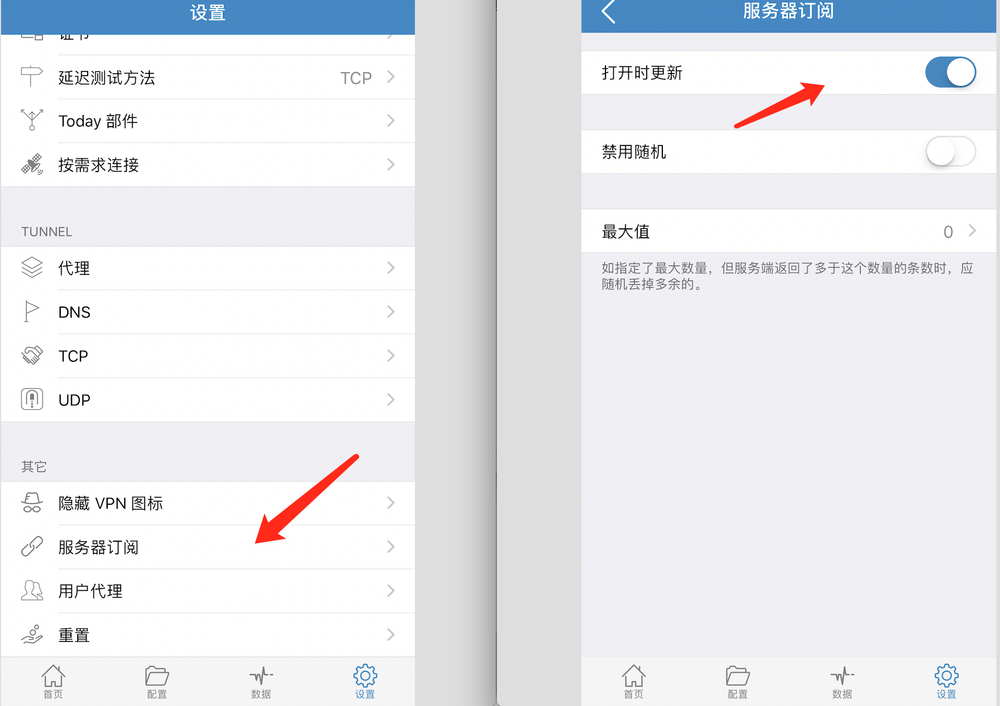
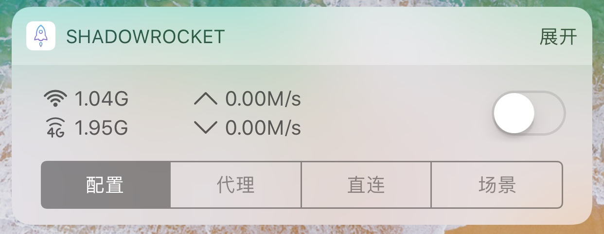

# iOS - Shadowrocket

如果有自己的美区账号，则可以直接搜索Shadowrocket，购买并下载。


影猫为用户提供美区账号，并且已购买Shadowrocket，用户可以免费下载安装。



请在用户中心开工单索取美区账号


### 获取订阅链接

打开影猫官网，在[用户中心](https://sscat.me/user)可以查看自己的订阅链接，点击拷贝。​

### 将订阅链接导入客户端 {#jiang-ding-yue-lian-jie-dao-ru-ke-hu-duan}

打开Shadowrocket，在首页点击右上角的＋号，添加配置

添加节点类型为“Subscribe”，在URL栏目填入订阅链接，最后点击右上角完成。

回到APP首页，服务器节点已导入，选择任一节点，点击开关即可连接！延迟测试按钮可以测试节点的延迟，作为参考。


至此基本配置已完成，系统栏出现VPN图标。请测试能否访问[**google.com**](https://www.google.com)\*\*\*\*


### 全局路由

* 配置：按照配置文件规则访问，默认配置是国内直连、国外代理；可以在配置中修改规则。
* 代理：全部流量走代理。当配置规则无法打开某一网站时，可以尝试全局代理。

### 自动更新订阅

在设置页面，点击“服务器订阅”，打开自动更新开关，即可在客户端启动时自动更新服务器订阅

### 添加到widget（小组件）

推荐将shadowrocket添加至通知中心的widget，可以实现一键开关、查看实时网速等功能。

