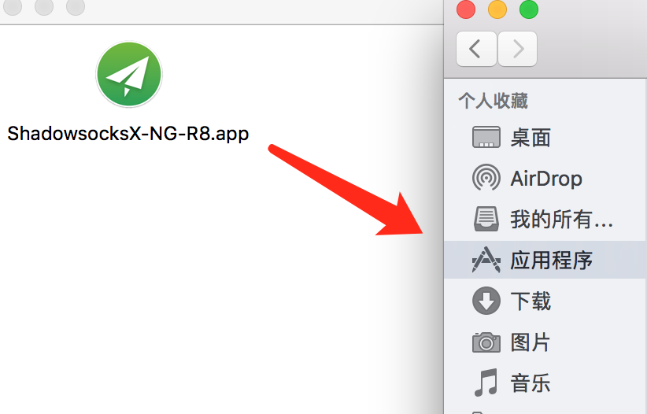
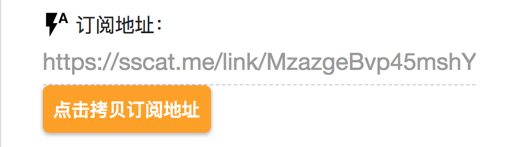
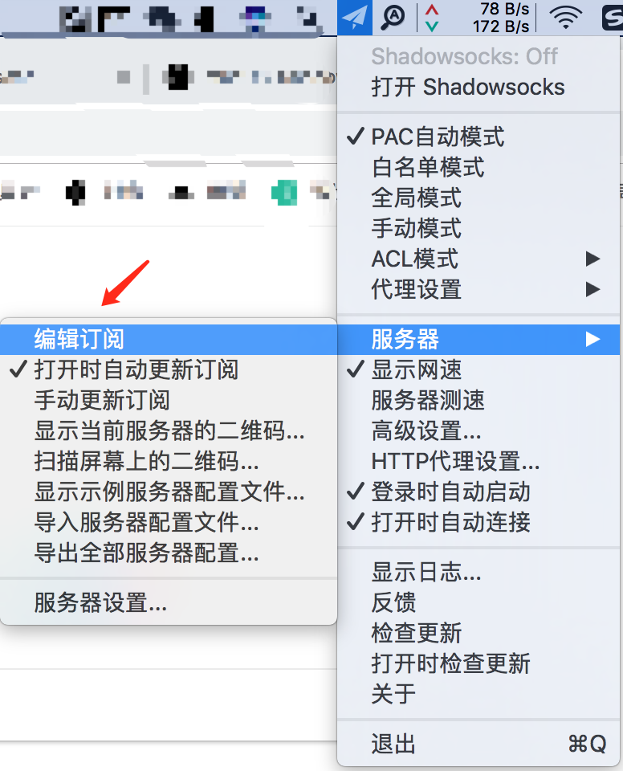
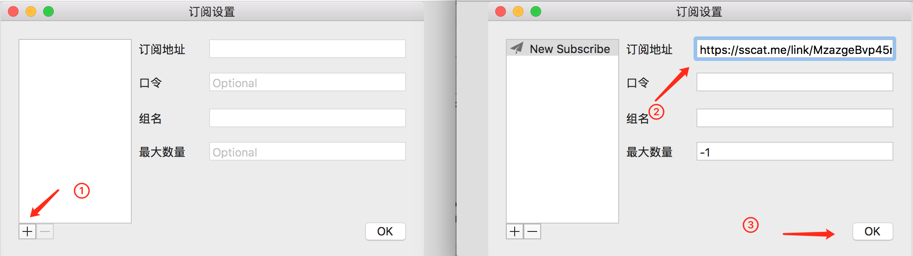
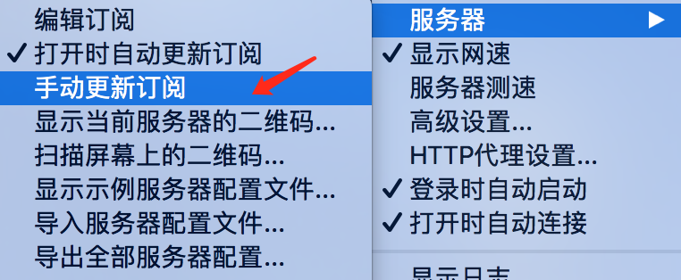
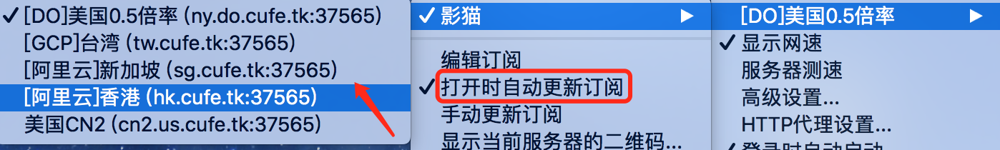
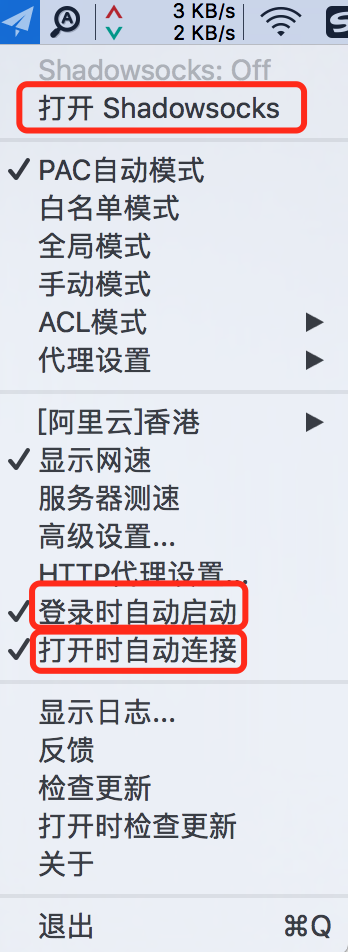

# MAC - SSR

### 客户端安装

点击下载：[影猫高速源](https://yun-1256050155.cos.ap-beijing.myqcloud.com/ssr/ssr-mac.dmg) 。下载完成后双击打开DMG文件，将.app程序拖入应用程序内（添加到Launchpad，方便我们下次打开）

**运行.app文件**，如弹出系统警告则点击确定运行，系统顶部菜单栏会出现“小飞机”图标，单击“小飞机”图标即可展开菜单界面。

### 获取订阅链接

打开影猫官网，在[用户中心](https://sscat.me/user)可以查看自己的订阅链接，点击拷贝。

### 将订阅链接导入客户端

点击系统菜单栏中的小飞机图标，在展开的菜单中，点击“`服务器`”，“`编辑订阅`”

弹出如下图所示的窗口，在窗口左下角点击`添加`按钮，然后将影猫订阅链接拷贝至订阅地址，其它栏目留空，最后点击确定。如下图①②③所示。

第一次导入订阅链接后，需要手动更新订阅。点击`小飞机图标-服务器-手动更新`订阅，即可完成订阅的操作。

### 连接节点

更新订阅后，服务器列表中将会导入影猫的所有节点，在服务器列表中**勾选**合适的节点。


建议勾选“打开时自动更新订阅”，这样在SSR启动时会自动更新服务器信息。


**最后，一定要点击“打开Shdowsocks”，**建议勾选“`打开时自动连接`” “`登陆时自动启动`”，省心！

尝试一下能否打开[google.com](https://www.google.com)吧！

### 代理模式的选择

新手常用的两个模式分别为PAC模式、全局模式

* PAC模式：按照一定的规则进行分流，国内网站直连，被墙的网站走代理
* 全局模式：全部流量走代理


一般情况下，影猫建议新手使用PAC模式，可以将SSR常驻后台，既可以科学上网，也不影响国内网站。若遇到个别网站打不开的情况，可以尝试开启全局模式。


