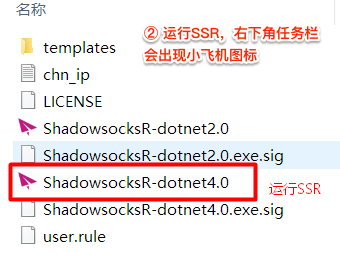
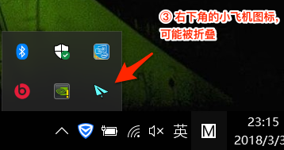
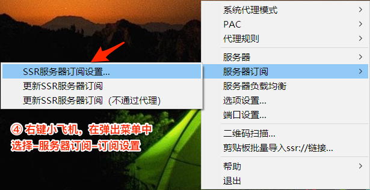
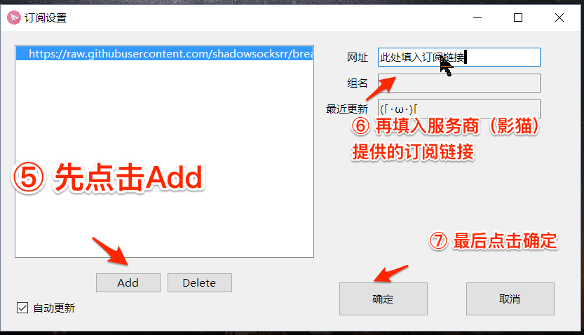
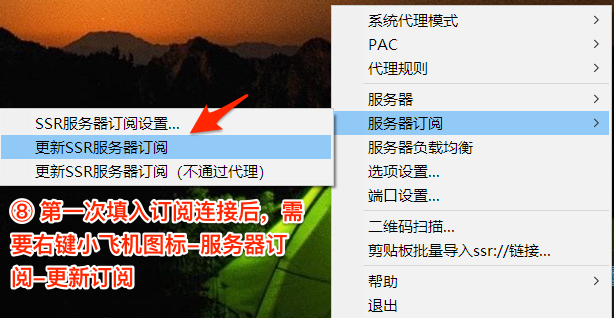
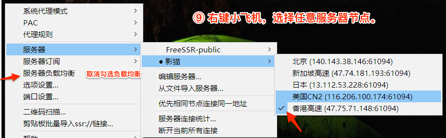
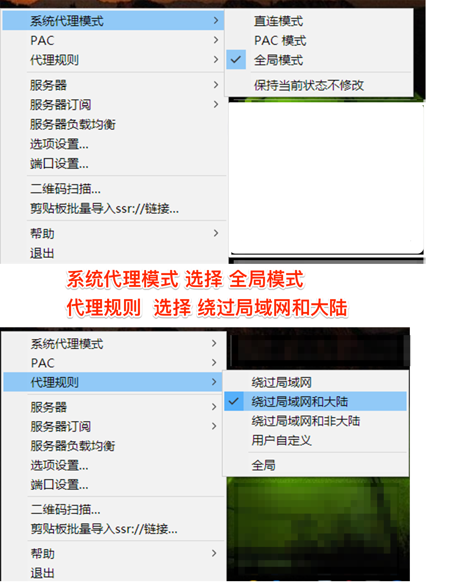

# Windows - SSR-dotnet

### 获取订阅链接

打开影猫官网，在[用户中心](https://sscat.me/user)可以查看自己的订阅链接，点击拷贝。

### 客户端安装

下载客户端：[影猫高速源](https://yun-1256050155.cos.ap-beijing.myqcloud.com/ssr/Windows%20ssr.zip)  ，并解压到合适的位置。此客户端是绿色版，无需安装。

运行客户端：运行dotnet4.0版本，如果是XP系统则运行2.0版本。

### 将订阅链接导入客户端

运行客户端后，系统右下角任务栏会出现小飞机图标（可能会被折叠，请展开全部图标后查看）。右键单击小飞机图标即可展开菜单栏。

在弹出的菜单中，找到`服务器订阅`-`SSR服务器订阅设置`

点击，弹出订阅设置窗口，在窗口中依次进行：

* 点击左下角Add，勾选`自动更新`
* 在如图所示的位置填入订阅链接
* 点击确定

新导入订阅链接后，需要手动更新订阅。在服务器订阅选项中，点击`更新SSR服务器订阅（不通过代理）`


更新订阅时有两个选项，一般情况下，选择（不通过代理）


订阅更新成功后，会弹出提示“影猫订阅已更新”。之后，在服务器中选择影猫的任一节点，勾选！


推荐新手关闭“服务器负载均衡”功能


### 设置代理模式

####  系统代理模式：

* PAC模式：按照一定的规则进行分流，国内网站直连，被墙的网站走代理
* 全局模式：全部流量走代理
* 直连模式：全部流量不走代理，相当于没有开启

#### 代理规则：

* 绕过局域网和大陆：在系统代理模式的基础上，再一次分流，不代理局域网和大陆IP


一影猫建议新手使用如下图的配置，系统代理模式选择全局，代理规则选择绕过局域网和大陆，如此配置可以达到“国内直连、国外代理”的效果，将SSR后台运行，既可以科学上网，也不减慢国内网站的访问速度。


