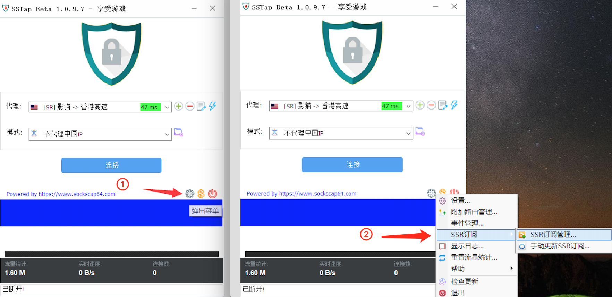
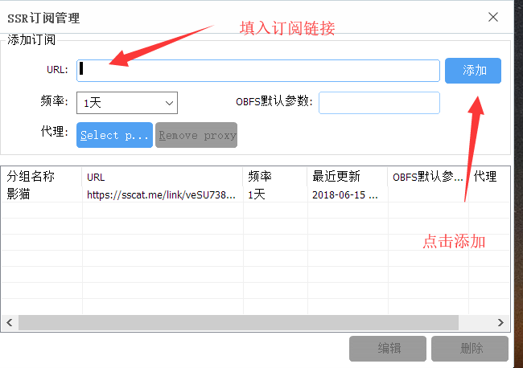

# Windows - SSTAP


SSTAP利用虚拟网卡将SSR转换为类似于VPN一样的全局代理，能同时转发TCP、UDP数据包。**非常适合于游戏玩家使用。**


### 获取订阅链接

打开影猫官网，在[用户中心](https://sscat.me/user)可以查看自己的订阅链接，点击拷贝。

### 客户端安装

* 版本号1.0.9.7  适合科学上网用户，包含全局代理规则，**推荐使用此版本。**
* 版本号1.1.0.1  适合游戏用户

下载地址：[\[推荐\]版本号1.0.9.7](https://yun-1256050155.cos.ap-beijing.myqcloud.com/ssr/%28%E6%8E%A8%E8%8D%90%29SSTap-beta-setup-1.0.9.7.exe.7z) \|  [版本号1.1.0.1](https://yun-1256050155.cos.ap-beijing.myqcloud.com/ssr/SSTap-beta-setup-1.1.0.1.exe.7z)

此客户端是安装包，下载完成后双击运行，进入安装界面，安装完成后点击桌面图标运行。

### 将订阅链接导入客户端

在SSTAP的主界面，点击设置按钮（如下图红箭头所示），点击`SSR订阅`-`SSR订阅管理`，并在弹出界面中，填写订阅链接。

在SSR订阅管理界面填入影猫的订阅链接


SSTAP会自动更新订阅链接，回到主界面，在下拉栏中选择合适的节点，选择合适的节点即可。


### 代理模式的选择

#### 旧版本（1.0.9.7）

* **全局：**顾名思义，整个电脑网络所有流量全部都走代理。
* **仅网页浏览器（全局）：**仅代理浏览器，所有网页走代理。
* **仅网页浏览器（跳过中国站点）：**仅代理浏览器，国内网站直连，国外网站代理，根据IP地址分流。
* **仅代理中国IP：**在全局的基础上仅代理中国IP，也就是只有访问国内IP的网络流量才会走代理。
* **不代理中国IP：**全局代理的基础上，代理海外IP的网络流量，而国内流量都直连，**新手选择此选项即可！**

**新版本（1.1.0.1）**

* 游戏玩家选择对应的游戏即可！

